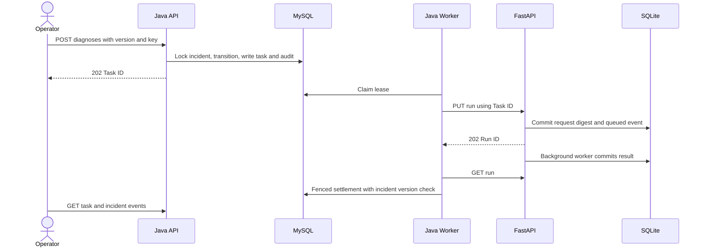

# 诊断调用顺序

```mermaid
sequenceDiagram
  actor S as Operator
  participant J as Java API
  participant M as MySQL
  participant W as Java Worker
  participant P as FastAPI
  participant Q as SQLite
  S->>J: POST diagnoses with version and key
  J->>M: Lock incident, transition, write task and audit
  J-->>S: 202 Task ID
  W->>M: Claim lease
  W->>P: PUT run using Task ID
  P->>Q: Commit request digest and queued event
  P-->>W: 202 Run ID
  P->>Q: Background worker commits result
  W->>P: GET run
  W->>M: Fenced settlement with incident version check
  S->>J: GET task and incident events
```

第一次 PUT 的响应丢失时，下一次 PUT 仍使用原来的 tenant、UUID 和请求体。接口返回同一个运行的当前快照。
